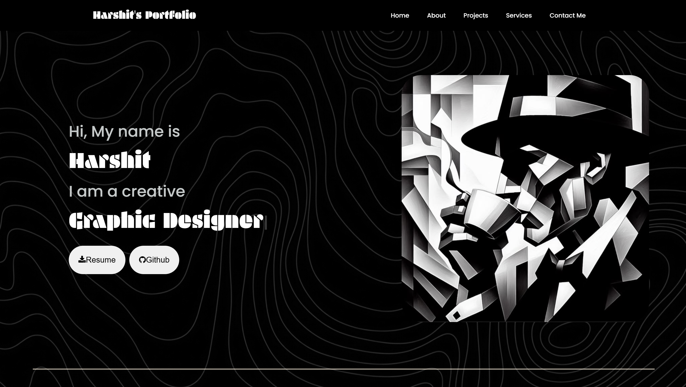

# My-Portfolio
Personal portfolio showcasing my work as a designer &amp; developer — crafted with clean code, creative design, and a focus on user experience.

Welcome to my personal portfolio repository!  
I’m a **Designer & Developer** passionate about crafting clean, user-friendly, and visually creative digital experiences.  

## 🚀 About This Project  
This portfolio is built to showcase my:  
- 💻 Development skills  
- 🎨 Design creativity  
- 📂 Projects & work highlights  
- 🧑‍💼 Services  

## ✨ Features  
- Responsive design for all devices  
- Smooth UI/UX interactions  
- Well-structured and clean code  
- Creative and minimal styling  

## 🛠️ Tech Stack  
- HTML5, CSS3, JS-libraries 
- Google Fonts and icons
- Adobe creative fonts

## 📸 Preview  
  

## 📬 Contact  
If you’d like to connect, collaborate, or just say hi 👋:  
- **Email:** [harshit.verma.07.20@gmail.com]  

---

⭐ If you like this portfolio, don’t forget to give the repo a star!
